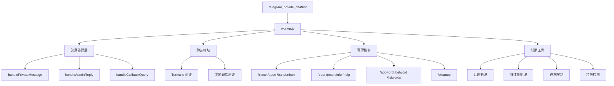

# Telegram Private Chatbot - 项目文档

> 基于 Cloudflare Workers 的高性能 Telegram 双向私聊机器人，v5.4

## 变更记录 (Changelog)

| 日期 | 变更内容 |
|------|----------|
| 2026-06-30 | 初始化项目文档，完成全仓扫描与架构分析 |
| 2026-06-30 | 补测：搭建 vitest 框架，88 个单元测试覆盖纯函数；监控：添加 notifyAdmin 告警与 spam 统计；维护：sync-claude-md.js 自动同步文档 |

---

## 项目愿景

为 Telegram 用户提供零成本、企业级的私聊管理机器人解决方案。利用 Cloudflare 边缘计算网络，实现消息转发、人机验证、内容过滤和话题管理，彻底解决 Telegram 上的垃圾广告骚扰问题。

---

## 架构总览

### 技术栈

| 层级 | 技术选型 |
|------|----------|
| 运行时 | Cloudflare Workers (V8 Isolate) |
| 存储 | Cloudflare KV (命名空间: TOPIC_MAP) |
| 语言 | JavaScript (ES Module) |
| 外部 API | Telegram Bot API、Cloudflare Turnstile API |

### 系统架构



### 消息流转

```
用户私聊消息 → Telegram → Webhook(POST /) → handlePrivateMessage
  → 速率限制检查 → 屏蔽词检查 → 垃圾检测 → 验证状态检查
  → 转发到话题(forwardMessage) → 管理员在话题内看到

管理员话题回复 → Telegram → Webhook(POST /) → handleAdminReply
  → 权限验证 → 指令处理 / 消息转发(copyMessage) → 用户收到回复
```

---

## 模块索引

| 模块 | 路径 | 职责 | 入口 |
|------|------|------|------|
| 根模块 | `./` | Cloudflare Worker 入口，业务逻辑主文件 | `worker.js` |
| 工具模块 | `src/` | 纯函数工具（屏蔽词、链接检测、哈希等），独立可测试 | `src/utils.js` |
| 测试 | `tests/unit/` | 单元测试（5 文件 / 88 用例） | `vitest run` |
| 脚本 | `scripts/` | 文档自动同步 | `scripts/sync-claude-md.js` |

---

## 运行与开发

### 前置条件

- Cloudflare 账号
- Telegram Bot Token（从 @BotFather 获取）
- Telegram 群组（开启话题功能，群组 ID 以 -100 开头）
- Node.js（用于本地开发，可选）

### 本地开发

```bash
# 使用 Wrangler CLI 本地运行
npx wrangler dev

# 部署
npx wrangler deploy
```

### 环境变量配置

#### 必需变量

| 变量名 | 说明 |
|--------|------|
| `BOT_TOKEN` | Telegram Bot Token |
| `SUPERGROUP_ID` | 管理员群组 ID（-100 开头） |

#### KV 绑定

| 变量名 | 类型 | 说明 |
|--------|------|------|
| `TOPIC_MAP` | KV Namespace | 存储用户映射、验证状态、话题信息 |

#### 可选变量

| 变量名 | 说明 |
|--------|------|
| `TURNSTILE_SITE_KEY` | Turnstile Site Key（启用 Turnstile 验证） |
| `TURNSTILE_SECRET_KEY` | Turnstile Secret Key |
| `VERIFICATION_PAGE_URL` | Worker 完整 URL |
| `SPAM_KEYWORDS` | 垃圾关键词（逗号分隔） |
| `SPAM_SILENCE_MODE` | 静默模式（true/false） |
| `ADMIN_IDS` | 管理员用户 ID 白名单（逗号分隔） |

### Webhook 激活

```
https://api.telegram.org/bot<TOKEN>/setWebhook?url=<WORKER_URL>
```

---

## 测试策略

使用 **vitest** 框架，单元测试覆盖 `src/utils.js` 中全部 10 个纯函数（88 个用例）。

```bash
npm test              # 运行全量测试
npm run test:watch    # 监听模式
npm run test:coverage # 覆盖率报告
```

测试文件位于 `tests/unit/`：

| 文件 | 覆盖函数 | 用例数 |
|------|----------|--------|
| `blocked-words.test.js` | `containsBlockedWord` | 14 |
| `link-detection.test.js` | `containsLink` | 18 |
| `spam-detection.test.js` | `detectSpamKeywords`, `computeMessageHash` | 17 |
| `spam-keywords-parser.test.js` | `parseSpamKeywords` | 16 |
| `telegram-helpers.test.js` | `normalizeTgDescription`, `isTopicMissingOrDeleted`, `isTestMessageInvalid`, `withMessageThreadId`, `generateVerifyCode` | 23 |

后续可补充的方向：

1. **集成测试**：模拟 Telegram webhook 请求，验证消息转发流程
2. **E2E 测试**：使用测试 Bot Token 验证完整消息流转

---

## 编码规范

- 语言：JavaScript (ES Module)，运行于 Cloudflare Worker 环境
- 代码风格：函数式编程，顶层 `const` 常量配置
- 日志：结构化 JSON 日志，通过 `Logger` 工具输出
- 注释：关键函数使用 JSDoc 风格注释
- 错误处理：所有异步操作使用 try-catch，不向用户泄露技术细节
- 并发保护：使用 `Map` 实例内缓存 + KV 原子操作

---

## AI 使用指引

### 代码修改注意事项

1. **KV 键名约定**：
   - `user:{userId}` - 用户话题记录（JSON）
   - `thread:{threadId}` - 话题到用户的映射
   - `verified:{userId}` - 验证状态（"1" 或 "trusted"）
   - `banned:{userId}` - 封禁状态
   - `chal:{verifyId}` - 验证挑战状态
   - `blocked_words_kv` - 动态屏蔽词库

2. **配置修改**：所有可调参数集中在 `CONFIG 对象`（第 4-32 行）

3. **新增管理员指令**：在 `handleAdminReply` 函数中添加（第 1311 行起）

4. **验证方式切换**：通过环境变量 `TURNSTILE_SITE_KEY` / `TURNSTILE_SECRET_KEY` / `VERIFICATION_PAGE_URL` 控制，未配置时自动降级为本地题库

### 关键函数索引

> 见下方自动生成的完整函数索引表（`<!-- AUTO-GENERATED START: functions -->

## 关键函数索引（自动生成）

> 由 `scripts/sync-claude-md.js` 自动生成，最后同步：2026-06-30。

### worker.js 主函数

| 函数 | 行号 | 职责 |
|------|------|------|
| `getBlockedWords` | L98 | 获取完整屏蔽词列表 = 硬编码 + KV 动态词库（合并去重） |
| `secureRandomInt` | L195 | 加密安全的随机数生成 |
| `secureRandomId` | L202 | — |
| `safeGetJSON` | L210 | 安全的 JSON 获取 |
| `getOrCreateUserTopicRec` | L227 | — |
| `probeForumThread` | L252 | — |
| `resetUserVerificationAndRequireReverify` | L308 | — |
| `parseAdminIdAllowlist` | L334 | — |
| `isAdminUser` | L347 | — |
| `getAllKeys` | L384 | 获取所有 KV keys（处理分页） |
| `shuffleArray` | L398 | Fisher-Yates 洗牌算法 |
| `checkRateLimit` | L408 | 速率限制检查 |
| `verifyTurnstileToken` | L430 | 调用 Cloudflare Turnstile API 验证 token |
| `getSpamKeywords` | L459 | 加载/解析垃圾关键词列表 |
| `detectRepeatMessage` | L477 | 检测用户是否在短时间内重复发送相同内容 |
| `pruneMessageHashCache` | L503 | 定期清理过期的 messageHashCache 条目（防止内存无限增长） |
| `spamCheck` | L519 | 综合垃圾检测（关键词 + 链接 + 重复） |
| `notifyAdmin` | L568 | 用于关键异常（转发失败、KV 异常等）向管理员发送即时通知 |
| `updateSpamStats` | L590 | 异步更新 spam 统计计数（在 waitUntil 中调用，不阻塞主响应） |
| `handleSpamMessage` | L613 | 处理垃圾消息（通知管理员或静默丢弃） |
| `escapeHtml` | L649 | HTML 转义函数（防止 XSS：验证页面模板中的用户输入注入） |
| `showStatus` | L699 | — |
| `onTurnstileSuccess` | L704 | — |
| `onTurnstileError` | L749 | — |
| `handlePrivateMessage` | L1010 | ---------------- 核心业务逻辑 ---------------- |
| `forwardToTopic` | L1068 | 职责：前置检查 → 获取/创建话题 → 健康检查 → 执行转发 |
| `checkThreadHealth` | L1145 | 话题健康检查 — 双层缓存（内存 + KV）+ 探测 |
| `executeMessageForward` | L1197 | 执行消息转发 — forwardMessage → copyMessage 降级 + 重定向检测 |
| `handleForwardRedirect` | L1231 | 处理转发重定向 — 删除误投消息 + 触发重建 |
| `handleForwardFailure` | L1257 | 处理转发失败 — 话题丢失检测 + copyMessage 降级 + 通知管理员 |
| `removeCommandBotSuffix` | L1303 | 例如：/listwords@callcosr_bot -> /listwords |
| `handleAdminReply` | L1309 | — |
| `handleHelpCommand` | L1322 | --- 管理员命令处理函数 --- |
| `handleAddWordCommand` | L1351 | *关于：** |
| `handleDelWordCommand` | L1378 | — |
| `handleListWordsCommand` | L1412 | — |
| `handleCloseCommand` | L1433 | — |
| `handleOpenCommand` | L1444 | — |
| `handleResetCommand` | L1455 | — |
| `handleTrustCommand` | L1460 | — |
| `handleBanCommand` | L1466 | — |
| `handleUnbanCommand` | L1471 | — |
| `handleInfoCommand` | L1476 | — |
| `_handleAdminReplyInner` | L1490 | 职责：权限检查 → 全局命令路由 → 用户反查 → 话题内指令路由 → 消息转发 |
| `sendVerificationChallenge` | L1573 | ---------------- 验证模块 (纯本地) ---------------- |
| `_sendVerificationChallengeInner` | L1588 | — |
| `sendTurnstileChallenge` | L1646 | Turnstile 验证路径 — 发送验证按钮链接 |
| `sendLocalQuizChallenge` | L1701 | 本地题库验证路径 — 发送选择题 |
| `handleCallbackQuery` | L1749 | — |
| `forwardPendingMessages` | L1870 | 验证通过后转发待处理消息 — 并行转发 + 去重 + 通知用户 |
| `handleCleanupCommand` | L1941 | - 需要批量重置这些用户的状态 |
| `createTopic` | L2101 | 为话题建立 thread->user 映射，避免管理员命令时全量 KV 反查 |
| `updateThreadStatus` | L2115 | 更新话题状态 |
| `buildTopicTitle` | L2152 | 改进的话题标题构建（清理特殊字符） |
| `tgCall` | L2180 | 改进的 Telegram API 调用（添加超时和 HTTPS 强制） |
| `handleMediaGroup` | L2240 | — |
| `extractMedia` | L2261 | 改进的媒体提取（支持更多类型，不修改原数组） |
| `flushExpiredMediaGroups` | L2313 | 实现媒体组清理 |
| `delaySend` | L2336 | 改进媒体组延迟发送 |

### src/utils.js 纯函数

| 函数 | 行号 | 职责 |
|------|------|------|
| `containsBlockedWord` | L12 | 检查文本是否包含屏蔽词 |
| `containsLink` | L28 | 检测消息文本中是否包含 URL/链接 |
| `detectSpamKeywords` | L45 | 检测消息是否包含垃圾关键词 |
| `computeMessageHash` | L63 | 计算消息内容的简单哈希（用于重复检测） |
| `normalizeTgDescription` | L77 | 标准化 Telegram API 描述字符串 |
| `isTopicMissingOrDeleted` | L86 | 判断话题是否不存在或已被删除 |
| `isTestMessageInvalid` | L102 | 判断探测消息是否因内容为空而失败 |
| `withMessageThreadId` | L114 | 为请求 body 添加 message_thread_id 字段 |
| `parseSpamKeywords` | L124 | 将 SPAM_KEYWORDS 环境变量解析为关键词数组 |
| `generateVerifyCode` | L136 | 生成安全的验证 code（16 字节十六进制） |

<!-- AUTO-GENERATED END: functions -->

<!-- AUTO-GENERATED START: config -->


## CONFIG 配置项（自动生成）

> 由 `scripts/sync-claude-md.js` 自动生成，对应 worker.js 中的 CONFIG 对象。

| 配置项 |
|--------|
| `VERIFY_ID_LENGTH` |
| `VERIFY_EXPIRE_SECONDS` |
| `VERIFIED_EXPIRE_SECONDS` |
| `MEDIA_GROUP_EXPIRE_SECONDS` |
| `MEDIA_GROUP_DELAY_MS` |
| `PENDING_MAX_MESSAGES` |
| `ADMIN_CACHE_TTL_SECONDS` |
| `NEEDS_REVERIFY_TTL_SECONDS` |
| `RATE_LIMIT_MESSAGE` |
| `RATE_LIMIT_VERIFY` |
| `RATE_LIMIT_WINDOW` |
| `BUTTON_COLUMNS` |
| `MAX_TITLE_LENGTH` |
| `MAX_NAME_LENGTH` |
| `API_TIMEOUT_MS` |
| `CLEANUP_BATCH_SIZE` |
| `MAX_CLEANUP_DISPLAY` |
| `CLEANUP_LOCK_TTL_SECONDS` |
| `MAX_RETRY_ATTEMPTS` |
| `THREAD_HEALTH_TTL_MS` |
| `TURNSTILE_VERIFY_TTL` |
| `NEW_USER_LINK_BLOCK_SECONDS` |
| `SPAM_MESSAGE_HASH_TTL` |
| `SPAM_REPEAT_MESSAGE_LIMIT` |
| `SPAM_NOTIFY_ADMIN` |
| `SPAM_SILENCE_MODE` |

<!-- AUTO-GENERATED END: config -->

<!-- AUTO-GENERATED START: kv-keys -->


## KV 键名约定（自动生成）

> 由 `scripts/sync-claude-md.js` 自动扫描 `env.TOPIC_MAP` 调用提取。

| 键名模式 |
|----------|
| `banned:{id}` |
| `blocked_words_kv` |
| `chal:{id}` |
| `needs_verify:{id}` |
| `retry:{id}` |
| `thread:{id}` |
| `thread_ok:{id}` |
| `turnstile_code:{id}` |
| `turnstile_msg:{id}` |
| `user_challenge:{id}` |
| `verified:{id}` |
| `verified_ts:{id}` |

<!-- AUTO-GENERATED END: kv-keys -->
